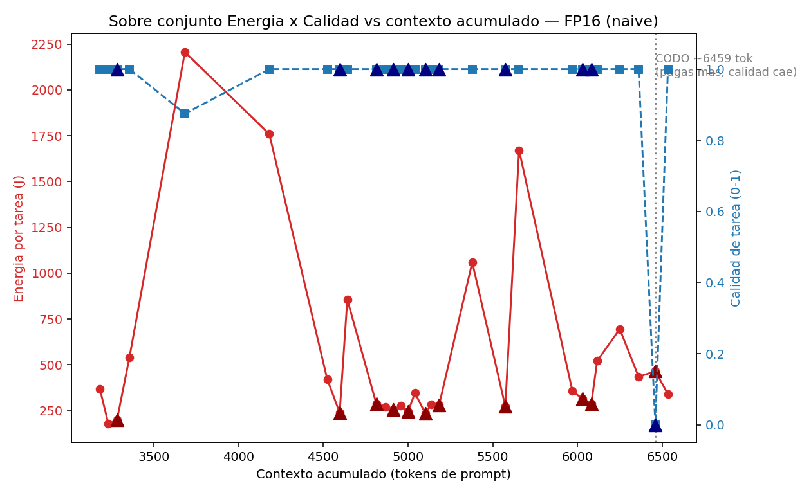
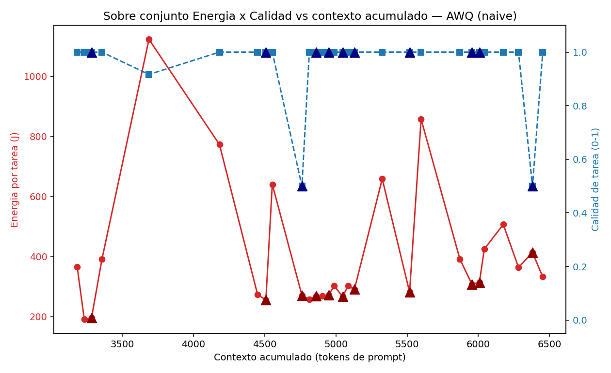
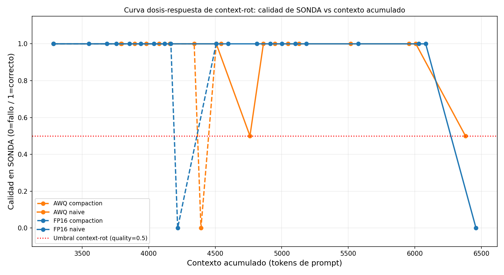

**INFERA: un marco reproducible para caracterizar el sobre conjunto energía–calidad de la acumulación de contexto y la rentabilidad energética de la compactación en la inferencia autónoma de modelos de lenguaje pequeños sobre hardware de consumo**

Daniela Mora Guevara

*Universidad de Especialidades Espíritu Santo (UEES), Samborondón, Ecuador*

daniela.mora@uees.edu.ec

---

## Resumen

El abandono progresivo de las interfaces comerciales de modelos de lenguaje hacia el auto-hospedaje de modelos abiertos está motivado por los límites de uso, los costos impredecibles y la soberanía sobre los datos, y rara vez por la sostenibilidad. Sin embargo, la literatura que cuantifica el costo de la inferencia se ha concentrado en hardware de centro de datos y en escenarios saturados, y ha dejado sin caracterizar el régimen que efectivamente vive el practicante individual, el estudiante o la pequeña organización: un solo equipo, peticiones servidas de a una y un contexto conversacional que crece a lo largo de una sesión de trabajo. En ese régimen, alargar el contexto cobra un doble precio que ningún trabajo previo ha medido de forma conjunta sobre hardware accesible: la energía por token producido crece —por el costo de la atención y por el crecimiento de la caché de claves y valores— al mismo tiempo que la calidad de la respuesta se degrada por el fenómeno conocido como deterioro de contexto. Este trabajo desarrolla INFERA, un marco reproducible que mide ambas curvas sobre un mismo eje de contexto acumulado en un modelo LLaMA 3.1 8B Instruct servido localmente con vLLM, localiza el punto de inflexión a partir del cual el usuario paga más energía por peor calidad, y evalúa empíricamente si la compactación proactiva del contexto recupera eficiencia y calidad una vez descontado el costo energético de la propia operación de resumen. El caso de estudio es una empresa ecuatoriana de seguridad privada, con tareas operativas reales —clasificación disciplinaria, redacción de memorandos, asignación de turnos con restricciones y consulta de registros—, lo que dota al experimento de validez ecológica. El protocolo de medición se validó en un experimento factorial piloto previo de 243 corridas sobre el mismo instrumento. Este documento presenta el marco y sus resultados hasta el nivel de datos crudos, sin interpretación; el análisis de implicaciones se reserva para una fase posterior.

---

# 1.  Introducción

El despliegue de modelos de lenguaje de gran escala dejó de ser un dominio reservado a laboratorios con infraestructura especializada y se convirtió en una práctica accesible a una población que excede ampliamente a las grandes corporaciones: estudiantes, desarrolladores independientes, personas que transitan desde la programación asistida hacia una comprensión más profunda de la ingeniería de sistemas, y pequeñas organizaciones con presupuestos ajustados. La disponibilidad de modelos abiertos con capacidad competitiva, como la familia LLaMA [1], permite que un equipo pequeño ejecute inferencia de lenguaje natural sin depender de proveedores externos. Una unidad de procesamiento gráfico de consumo, arrendable por hora en plataformas de nube, basta hoy para servir un modelo de ocho mil millones de parámetros en condiciones de tiempo real gracias a servidores de inferencia que gestionan la memoria con paginación de la caché de claves y valores [2].

Para esta población, el modelo de suscripción mensual y, sobre todo, los límites de uso por ventana de tiempo impuestos por los proveedores se han convertido en una fricción concreta: el servicio se interrumpe, encarece o restringe justo cuando se lo necesita. La respuesta natural ha sido el auto-hospedaje de modelos abiertos, que promete independencia del proveedor, costo predecible y control sobre la privacidad de los datos. Esta migración rara vez se justifica por motivos ambientales, pero el costo energético de la inferencia es un problema real y creciente que el usuario que se auto-hospeda asume directamente, a diferencia del usuario de interfaz comercial, para quien ese costo es invisible y diferido. La preocupación por la huella ambiental del aprendizaje automático se concentró inicialmente en el entrenamiento [15], pero el peso de la inferencia en el costo total crece a medida que los modelos se despliegan masivamente, hasta concentrar la mayor parte del consumo energético del ciclo de vida de un modelo en servicio [17], de modo que la decisión de auto-hospedaje traslada al practicante una responsabilidad energética que antes no percibía.

El cuerpo de trabajo que mide el costo de la inferencia ha respondido en su mayoría desde la perspectiva del operador de centro de datos y bajo condiciones de saturación, donde la eficiencia es máxima [5, 12]. Ese encuadre no describe el régimen del practicante individual, que sirve peticiones de a una sobre un único equipo cuya tarjeta permanece ociosa la mayor parte del tiempo, y que trabaja en sesiones donde el contexto se acumula —como en un proyecto de un asistente conversacional— a medida que encadena tareas. Es precisamente en la acumulación de contexto donde aparece un fenómeno doblemente costoso para este usuario y que la literatura ha estudiado de forma fragmentada. Por un lado, la energía por token producido crece de manera no lineal con la longitud del contexto, debido al costo de la atención y al crecimiento de la caché de claves y valores [4]. Por otro, la calidad de las respuestas se degrada mucho antes de agotar la ventana de contexto nominal, un efecto documentado de forma consistente en modelos frontera [22]. El usuario que se auto-hospeda paga ambos precios a la vez —más joules y peor calidad— sin que ningún trabajo previo haya trazado ese sobre conjunto sobre su hardware.

Este estudio aborda ese vacío. El aporte no es una nueva herramienta de compactación —ya existen varias— ni un método de compresión de propósito general, sino un protocolo experimental reproducible y la caracterización medida que de él se deriva. La respuesta se construye midiendo, sobre el mismo eje de contexto acumulado, la curva de energía por tarea y la curva de calidad de tarea en un modelo LLaMA 3.1 8B Instruct servido con vLLM, y comparando un brazo de acumulación sin intervención contra un brazo de compactación. La sección 3 formaliza esta idea como problema de investigación, pregunta, objetivos e hipótesis.

El objetivo general es desarrollar y validar INFERA, un marco reproducible que caracterice el sobre conjunto energía–calidad de la inferencia con contexto creciente en un modelo pequeño auto-hospedado, y que evalúe la rentabilidad energética de la compactación de contexto. El protocolo se diseña para ser portado por cualquier practicante: los documentos que definen el conocimiento de proyecto y la secuencia de tareas pueden sustituirse por los de otra organización conservando los rangos de tokens, lo que preserva la comparabilidad del experimento entre instituciones.

El documento se organiza en torno a la estructura clásica de un artículo experimental. La segunda sección establece el marco teórico de la inferencia autoregresiva, la degradación por contexto, la cuantización y la medición energética. La tercera plantea el problema, la pregunta y las hipótesis. La cuarta delimita el trabajo frente a la evidencia previa. La quinta describe los materiales y el método con el detalle necesario para reproducir el experimento. La sexta presenta los resultados hasta el nivel de datos crudos, sin interpretación.

# 2.  Marco teórico

## 2.1  Inferencia autoregresiva y dinámica del contexto

La arquitectura Transformer [3], que situó el mecanismo de atención como operación central del procesamiento del lenguaje, genera texto de forma autoregresiva: cada token nuevo se condiciona sobre todo el contexto ya procesado. La inferencia transcurre en dos fases con perfiles de costo distintos. En la fase de prellenado el modelo procesa el prompt completo en paralelo y construye la caché de claves y valores que reutilizará durante la generación; el costo de esta fase crece con la longitud de entrada, porque la atención relaciona cada par de tokens, y está limitada por la capacidad aritmética del acelerador. En la fase de decodificación el modelo emite tokens uno a uno reutilizando esa caché; aquí el cuello de botella no es el cómputo sino el ancho de banda de memoria, ya que cada paso lee la caché desde la memoria de la tarjeta [4]. Cuanto mayor es el contexto activo, mayor es el tráfico de memoria por paso de decodificación y mayor la presión sobre la memoria disponible.

Esta dependencia tiene una formulación analítica reciente. Se ha derivado que los tokens generados por vatio se reducen aproximadamente a la mitad cada vez que la ventana de contexto se duplica, relación que sus autores denominan la ley 1/W [4]. La derivación se sustenta en mediciones de potencia sobre aceleradores de centro de datos a escala de flota, en rangos de contexto de varios miles a más de cien mil tokens; no se acompaña de experimentos sobre hardware de consumo en el rango de contexto y la modalidad de servicio que enfrenta un despliegue individual. La consecuencia operativa es que, en una sesión donde el contexto se acumula, el costo energético de cada nueva tarea no es constante, sino que aumenta a medida que la conversación crece.

## 2.2  Degradación de la calidad por longitud de contexto

Un supuesto extendido sostiene que un modelo procesa su contexto de manera uniforme, de modo que el token diez mil se atiende con la misma fiabilidad que el token cien. Ese supuesto no se sostiene en la práctica. La evidencia empírica sobre modelos frontera muestra que el desempeño se vuelve cada vez menos fiable a medida que crece la longitud de la entrada, incluso en tareas simples, y que la longitud de entrada es una causa de primer orden de la degradación, independiente de la dificultad de la recuperación de información [22]. Este fenómeno, denominado deterioro de contexto, implica que la calidad de las respuestas puede caer mucho antes de agotar la ventana de contexto nominal del modelo. La caracterización publicada se ha realizado sobre modelos accedidos por interfaz comercial y, de manera determinante para este trabajo, sin medir energía: documenta la curva de calidad pero no la de consumo.

## 2.3  Cuantización en la inferencia de modelos de lenguaje

La cuantización reduce la precisión numérica de los pesos del modelo para disminuir su huella en memoria y, en ciertos esquemas, acelerar la multiplicación de matrices. La semiprecisión de punto flotante de dieciséis bits sirve de referencia. La compresión de los pesos a cuatro bits mediante una calibración que preserva los pesos de mayor influencia a partir de la magnitud de las activaciones [10] reduce la huella del modelo a unos pocos gigabytes y libera memoria que el servidor puede reasignar a la caché de claves y valores. La representación de los pesos en enteros de ocho bits con descomposición dinámica de valores atípicos [9] constituye una tercera opción de adopción frecuente. Que un esquema de menor precisión sea siempre más eficiente no es un hecho establecido sino una expectativa que conviene poner a prueba: la caracterización sistemática de la cuantización en condiciones de servicio realista muestra que el ahorro energético depende de la tarea, del esquema y de la carga, y que puede desaparecer cuando la línea base no satura [11]. Este trabajo contrasta la referencia de dieciséis bits con el esquema de cuatro bits, los dos que el practicante adopta con más frecuencia para servir un modelo de ocho mil millones de parámetros sobre una tarjeta de consumo.

## 2.4  Medición energética y protocolos de referencia

El programa de la inteligencia artificial eficiente propuso incorporar la eficiencia computacional y energética como criterio de evaluación junto a la calidad [8], y motivó recomendaciones para el reporte sistemático de la energía y la huella de carbono del aprendizaje automático [18]. La medición energética en inferencia se apoya en interfaces de software que reportan la potencia instantánea del acelerador. Estas interfaces son adecuadas para contrastar configuraciones sobre un mismo equipo, aunque tienden a subestimar el consumo dinámico respecto a un vatímetro físico de referencia, validación que trabajos recientes han cuantificado de forma explícita [19], por lo que sus valores absolutos deben interpretarse con cautela. El protocolo de medición que adopta este trabajo, derivado del marco MELODI y de su caracterización de la energía de la inferencia [6], establece la necesidad de un margen temporal antes y después de cada inferencia para capturar los estados transitorios; la variación sistemática de ese margen determinó que quinientos milisegundos producen una captura completa, mientras que valores inferiores la anulan [6]. Los protocolos de evaluación de eficiencia para inferencia adoptan el tiempo hasta el primer token y el tiempo por token de salida como indicadores de latencia, y están diseñados para contrastar sistemas de centro de datos [5]; los conjuntos de referencia que atribuyen la energía a las fases de prellenado y decodificación operan en el mismo régimen saturado [7, 12]. Para sintetizar configuraciones heterogéneas en un único valor comparable se han propuesto índices compuestos normalizados [14]. INFERA hereda el margen temporal de medición [6] y la atribución de energía por fase [7, 12], y los aplica al régimen no estudiado del despliegue individual con contexto acumulativo, incorporando además una dimensión que estos protocolos no contemplan: la calidad de la tarea.

# 3.  Planteamiento del problema, pregunta de investigación, objetivos e hipótesis

**Problema.** No existe una caracterización medida y reproducible, sobre hardware accesible, del costo conjunto energético y de calidad de la acumulación de contexto en modelos pequeños auto-hospedados, ni una evaluación del balance energético de la compactación como mitigación.

**Pregunta de investigación.** Para un modelo de lenguaje pequeño auto-hospedado sobre hardware de clase consumo, bajo una carga realista de sesión de proyecto con contexto acumulativo: ¿en qué punto de acumulación de contexto la energía marginal por tarea crece mientras la calidad de tarea se degrada, y la compactación proactiva del contexto recupera eficiencia y calidad una vez descontado su propio costo energético?

**Objetivo general.** Caracterizar de manera reproducible el sobre conjunto energía–calidad de la inferencia con contexto creciente en un modelo pequeño auto-hospedado, y evaluar la rentabilidad energética de la compactación de contexto.

Como objetivos específicos se plantea medir la energía por tarea —en joules, mediante la interfaz de gestión de la tarjeta— y la calidad de tarea —mediante verificación programática— a lo largo de una sesión de contexto creciente para los esquemas de dieciséis y de cuatro bits; localizar el punto de inflexión conjunto, o codo, donde la energía marginal aumenta y la calidad disminuye; cuantificar el impuesto de compactación, entendido como el costo energético de generar el resumen de traspaso; comparar el brazo de acumulación sin intervención contra el brazo de compactación en energía total, calidad media y punto de equilibrio; y publicar el marco como artefacto reproducible.

**Hipótesis.** H1: existe un punto de acumulación de contexto a partir del cual la energía por tarea crece mientras la calidad de tarea decrece, de modo que el sobre conjunto presenta un codo identificable. H2: la compactación proactiva reduce la energía por tarea posterior y recupera calidad, pero su rentabilidad neta depende del costo de la operación de resumen y del punto en que se aplica. H3: el codo y la rentabilidad de la compactación dependen del esquema de cuantización.

# 4.  Trabajos relacionados y delimitación

La degradación de calidad por longitud de contexto está documentada para modelos frontera, donde la precisión cae mucho antes de llenar la ventana nominal y la longitud de entrada es una causa de primer orden de la degradación [22]; estos trabajos, no obstante, se realizan sobre modelos accedidos por interfaz comercial y no miden energía. Del lado energético, la dependencia de la eficiencia respecto del contexto es conocida —la métrica de tokens por vatio puede variar de forma marcada a lo largo del rango de contexto [4]—, pero esos análisis no incorporan calidad y se sitúan en hardware de centro de datos. El trabajo más cercano al presente, *The Efficiency Frontier* [20], une costo y rendimiento para decidir estrategias de gestión de contexto, pero emplea el número de tokens como aproximación del costo y una medida de calidad sobre preguntas sintéticas; al usar tokens como proxy, no captura que en hardware local la energía por token no es constante a lo largo de la ventana. La caracterización conjunta de energía y calidad para cuantización [11], la medición de potencia de servicio [12] y la caracterización de los compromisos energía–rendimiento a través de cargas y escalas de hardware [13] permanecen en el régimen saturado de centro de datos. Respecto de la compactación, trabajos como SUPO [21] optimizan el resumen del historial para preservar el éxito de la tarea del agente, pero no analizan si resumir ahorra energía neta; los marcos de agentes en producción compactan por límite de ventana, no por un criterio energético medido.

Ningún trabajo de los citados ocupa, por tanto, la intersección que define el objetivo de este estudio (sección 3): energía medida —no aproximada por tokens— sobre hardware de consumo, bajo una sesión real con contexto acumulativo, con la prueba explícita del balance energético de la compactación sobre un modelo pequeño. El protocolo de medición hereda de MELODI [6] y se validó en un experimento factorial piloto previo, descrito en la sección de métodos, que ancla el extremo de contexto corto del sobre que aquí se caracteriza.

# 5.  Materiales y métodos

## 5.1  Enfoque y diseño general

El estudio adoptó un enfoque cuantitativo de alcance cuasi-experimental y medición instrumental. Fue cuasi-experimental porque se manipularon deliberadamente dos factores —el esquema de cuantización y el brazo experimental— sobre un sistema fijo, sin asignación aleatoria de sujetos ni grupo de control externo: el punto de comparación fue el propio brazo de acumulación sin intervención, frente al cual se evaluó el brazo de compactación. No se modificó la arquitectura interna del modelo ni se ajustaron sus pesos. La variable independiente principal fue el contexto acumulado, operacionalizada como el avance de una sesión incremental y registrada por el número de tokens de prompt que el servidor procesa efectivamente en cada tarea. Las variables independientes secundarias fueron el esquema de cuantización —dieciséis bits de punto flotante (FP16) y cuatro bits con cuantización consciente de activaciones (AWQ INT4)— y el brazo experimental —acumulación sin intervención frente a compactación—. Las variables dependientes fueron la energía por tarea y la calidad de tarea. La dimensión temporal fue transversal: todas las mediciones se recogieron en un período acotado y bajo condiciones equivalentes, de modo que las diferencias observadas fueran atribuibles a las variables manipuladas y no a cambios del entorno.

El trabajo se desarrolló en cuatro fases secuenciales, descritas en lo que resta de esta sección. La Fase 0 definió las variables, el diseño y el caso de estudio. La Fase 1 preparó el entorno y validó el instrumento de medición mediante un experimento piloto previo. La Fase 2 instrumentó y ejecutó el experimento principal, en dos subfases que se presentan juntas porque se implementaron en un mismo instrumento de software y se corrieron como un solo bloque de trabajo. La Fase 3 realizó el análisis y la síntesis de los datos producidos.

## 5.2  Fase 0 — Definición de variables, diseño y caso de estudio

El caso de estudio fue una empresa ecuatoriana de seguridad privada, anonimizada como VIGÍA Seguridad S.A. con datos íntegramente ficticios, construida sobre la estructura operativa real del sector —jerarquía de personal, modalidades de contrato, matriz de escalamiento disciplinario, registros de permisos médicos e inventario de uniformes—, con todos los individuos sustituidos por títulos de rol y los clientes por nombres ficticios basados en sector. El conocimiento de proyecto de VIGÍA se definió como el contexto fijo inicial, inyectado de forma idéntica al comienzo de toda sesión, emulando un proyecto de asistente con conocimiento cargado.

La sesión se definió como una conversación incremental única: una secuencia ordenada de tareas heterogéneas reales del negocio —consulta de hechos sobre el reglamento y los registros, clasificación de faltas disciplinarias con su base legal, verificación de restricciones duras en la asignación de turnos, redacción de memorandos formales con campos obligatorios y resumen de novedades—, donde cada par petición–respuesta se anexa al historial y hace crecer el contexto. Dentro de esa secuencia se intercalaron tareas de recuperación de información temprana, ubicadas deliberadamente en posiciones avanzadas de la sesión, que funcionan como sondas de deterioro de contexto: miden si el modelo conserva, bajo carga creciente, datos introducidos al inicio. Cada sesión se definió como aislada: sin memoria entre sesiones ni consultas cruzadas, siendo el conocimiento de proyecto la única información compartida entre ellas.

La unidad experimental se definió como una sesión completa por cada combinación de esquema de cuantización, brazo y repetición, con tres repeticiones por combinación: dos esquemas (FP16 y AWQ INT4) por dos brazos (acumulación y compactación) por tres repeticiones, doce sesiones principales en total. Cada sesión del brazo de acumulación se compuso de veintinueve tareas, de siete tipos sustantivos (consulta de hechos, clasificación, verificación de restricciones, redacción, resumen, recuperación y sondas de deterioro de contexto); el brazo de compactación añadió hasta tres llamadas de traspaso estructurado, disparadas al cruzar el umbral de contexto acumulado, hasta un máximo de treinta y dos tareas por sesión y un octavo tipo de tarea —el traspaso de compactación—. En conjunto, las doce sesiones principales se diseñaron para producir trescientos sesenta y seis registros a nivel de tarea (tres repeticiones por dos esquemas por las veintinueve más treinta y dos tareas de cada brazo). Adicionalmente se definió una sesión de control causal —brazo de acumulación únicamente, con contenido neutro pero con las mismas sondas en las mismas posiciones— para distinguir si una eventual caída de calidad respondía a la longitud del contexto o a interferencia semántica del contenido acumulado.

**Tabla 0.** Composición de la sesión del brazo de acumulación, por tipo de tarea (29 tareas).

| Tipo de tarea | Descripción breve | Cantidad |
| --- | --- | --- |
| Consulta de hechos (FACT) | Preguntas puntuales contra el conocimiento de proyecto: cargos, contactos, dotación y modalidad de turno de clientes, registros de permisos médicos | 8 |
| Sonda de deterioro de contexto (SONDA) | Preguntas breves sobre el conocimiento de proyecto, repetidas en distintas posiciones de la sesión para construir la curva dosis-respuesta de calidad frente a contexto acumulado | 11 |
| Recuperación (RECALL) | Preguntas sobre información generada por el propio modelo anteriormente en la sesión (memorandos redactados, diagnósticos revisados al inicio) | 3 |
| Verificación de restricciones (CONSTRAINT) | Asignación de rol de turnos sujeta a cobertura completa, no duplicidad de turno y descanso mínimo entre turnos | 2 |
| Redacción (DRAFT) | Memorando disciplinario formal con campos obligatorios | 2 |
| Resumen (SUMMARIZE) | Resumen de lo tratado hasta ese punto de la sesión o de una novedad operativa | 2 |
| Clasificación (CLASSIFY) | Clasificación de una falta disciplinaria con su base legal | 1 |
| **Total** | | **29** |

La anonimización del caso VIGÍA respondió al principio de minimización de datos de la Ley Orgánica de Protección de Datos Personales del Ecuador y se documenta como decisión metodológica: no se utilizaron datos reales de personas, clientes ni de la organización que inspiró el caso.

## 5.3  Fase 1 — Preparación del entorno y validación del instrumento

La medición se realizó sobre una tarjeta NVIDIA RTX 4090 de veinticuatro gigabytes (arquitectura Ada Lovelace) en un pod dedicado. El modelo, LLaMA 3.1 8B Instruct [1], se sirvió con vLLM 0.5.3 [2] mediante su interfaz compatible con la generación conversacional, con la plantilla de chat de LLaMA 3.1 aplicada internamente. La pila de software se fijó en versiones específicas —CUDA 12.1, PyTorch 2.3.1 y el enlace de Python de la interfaz de gestión de la tarjeta— y se registró en un archivo de reproducibilidad junto con el identificador de revisión del repositorio.

Antes de ejecutar el experimento principal, el instrumento de medición y la línea base de energía frente a contexto se validaron mediante un experimento factorial previo sobre la misma tarjeta: un diseño completo de cuatro factores con tres niveles cada uno —esquema de cuantización, concurrencia de solicitudes, longitud de salida y carga contextual—, ejecutado en tres repeticiones por configuración para un total de doscientas cuarenta y tres corridas, en peticiones aisladas con contexto estático inyectado y sin medición de calidad. Este piloto se diseñó para validar el funcionamiento del protocolo de muestreo de potencia y para caracterizar el comportamiento de la energía por token frente a la longitud de contexto en el régimen de contexto corto. Por construcción, no incluyó la variable de calidad ni el brazo de compactación y no formó parte de las hipótesis del estudio principal: funcionó exclusivamente como validación metodológica y como ancla del extremo de contexto corto del sobre energía–calidad que el experimento principal extiende hacia la acumulación realista de una sesión.

**Tabla 0a.** Diseño factorial del experimento piloto de validación del instrumento.

| Factor | Niveles | Valores |
| --- | --- | --- |
| Esquema de cuantización | 3 | FP16, INT8 (W8A16), AWQ INT4 |
| Concurrencia de solicitudes | 3 | 1, 4, 8 |
| Longitud de salida (tokens) | 3 | 64, 256, 512 |
| Carga contextual | 3 | Caso A, Caso B, Caso C |
| **Configuraciones (3⁴)** | | **81** |
| **Repeticiones por configuración** | | **× 3** |
| **Total de corridas** | | **243** |

## 5.4  Fase 2 — Instrumentación y ejecución del experimento principal

La instrumentación y la ejecución del experimento principal (Protocolo C) se implementaron en un único guion que mide la energía, ejecuta la petición y califica la calidad de cada tarea de forma atómica; por esa razón ambas etapas se describen como subfases de un mismo bloque de trabajo.

### 5.4.1  Subfase 2.1 — Instrumentación

La secuencia final de veintinueve tareas y el umbral de compactación no se definieron a priori, sino que se calibraron mediante una sesión previa de diecinueve tareas con tres sondas de recuperación distribuidas a aproximadamente 3300, 4650 y 5950 tokens de contexto acumulado, pensada para construir una curva dosis-respuesta preliminar de la degradación de calidad por esquema de cuantización. A partir de los datos de esa calibración se tomaron dos decisiones de diseño para la sesión final: fijar el umbral de compactación en cuatro mil tokens —aproximadamente la mitad de la ventana de contexto del modelo, configurada en 8192 tokens—, y añadir sondas adicionales en la franja de contexto cubierta por las tres sondas de calibración, para localizar el codo con mayor precisión en la sesión final.

Se construyó el conocimiento de proyecto de VIGÍA Seguridad S.A. y se redactó la secuencia de veintinueve tareas resultante de esa calibración, incluyendo la ubicación deliberada de las sondas de recuperación en las posiciones avanzadas de la sesión. El almacenamiento en caché de prefijos se mantuvo desactivado por diseño, de modo que cada tarea midiera el reprocesamiento completo del contexto acumulado hasta ese punto. El conteo de tokens del conocimiento de proyecto y de cada tarea se verificó con el tokenizador del propio modelo [16], y se tomó como medida de contexto el campo de tokens de prompt que el servidor reporta para cada petición, no un conteo de palabras.

Para la calidad de tarea —variable nueva respecto del piloto— se definieron verificadores programáticos por tipo de tarea: presencia de los elementos requeridos (artículos del reglamento, porcentajes de sanción), presencia de al menos una variante por grupo semántico, ausencia de entidades prohibidas como detector de alucinación, presencia de los campos obligatorios en los memorandos, y satisfacción de las restricciones duras de la asignación de turnos —cobertura completa, no doble asignación en un mismo día y descanso mínimo entre turnos—. El puntaje por tarea se normalizó al intervalo [0, 1] combinando los sub-criterios aplicables a cada tipo, con la detección de alucinación operando como penalización multiplicativa.

La medición de energía por petición se integró en el mismo guion: un hilo independiente del proceso de inferencia muestreó la potencia de la tarjeta a diez hercios, es decir cada cien milisegundos, y aplicó un margen de quinientos milisegundos antes y después de cada llamada de inferencia, integrando el perfil de potencia en el tiempo por el método trapezoidal:

*E = Σ [ (Pᵢ + Pᵢ₋₁) / 2 ] · Δtᵢ*

donde Pᵢ es la potencia en vatios de la muestra i y Δtᵢ el intervalo entre muestras consecutivas. El margen de quinientos milisegundos es el mínimo que garantiza una captura completa según la validación del protocolo de referencia [6]. Se registraron además la potencia media y de pico, la duración, la memoria de vídeo pico y los tokens de prompt y de completado reportados por el servidor.

Antes de la corrida que produjo los datos reportados en la sección 6, se corrigieron dos defectos detectados durante la depuración del guion de ejecución —uno en la resolución de módulos del script de corrida continua, otro en uno de los verificadores de calidad de las sondas de recuperación—. Ambas correcciones se aplicaron antes de iniciar la ejecución final descrita en la subfase 2.2 y forman parte de la depuración normal del instrumento, no de una repetición del experimento.

### 5.4.2  Subfase 2.2 — Ejecución

Para cada combinación de esquema de cuantización y brazo se ejecutaron tres repeticiones de la sesión completa, precedidas por cinco peticiones de calentamiento descartadas y separadas por dos minutos de enfriamiento, replicando el protocolo del piloto. El orden de las tareas dentro de una sesión se mantuvo fijo en todas las repeticiones, porque la acumulación de contexto es la variable de interés y reordenarlas alteraría el eje que se mide.

En el brazo de acumulación, el contexto creció sin intervención a lo largo de las veintinueve tareas de la sesión. En el brazo de compactación, al cruzar un umbral de contexto acumulado se solicitó al mismo modelo un traspaso estructurado —decisiones y documentos generados, hechos clave consultados y pendientes—, se reinició el contexto al conocimiento de proyecto más el traspaso, y se continuaron las tareas restantes; la energía de esa llamada de traspaso se midió con el mismo protocolo descrito en la subfase 2.1 y constituye el impuesto de compactación. El umbral de compactación se fijó en cuatro mil tokens, valor determinado durante la calibración descrita en la subfase 2.1. Finalmente, se ejecutó la sesión de control causal definida en la Fase 0, en el brazo de acumulación, para los fines descritos en esa misma fase.

## 5.5  Fase 3 — Análisis y síntesis

El codo de contexto se localizó, para cada esquema de cuantización en el brazo de acumulación, mediante un criterio transparente: la primera tarea en la que la calidad cae por debajo de una fracción de la calidad basal de la sesión temprana mientras la energía por token de salida supera su mediana. La energía por petición se ajustó además, por mínimos cuadrados ordinarios, a un modelo lineal de dos términos consistente con la separación de costos de prellenado y decodificación descrita en la sección 2.1: *E = c + α · (tokens de contexto) + β · (tokens generados)*, donde α estima el costo energético marginal por token de contexto —prellenado— y β el costo marginal por token generado —decodificación—. Los registros de traspaso de compactación se excluyeron de este ajuste, porque corresponden a una llamada de resumen y no a una tarea de la secuencia, con un contexto de entrada de naturaleza distinta. Para evaluar la recuperación se compararon entre brazos la energía total por sesión, la calidad media y el impuesto de compactación medido en la Fase 2, determinando el punto de equilibrio en el que la energía ahorrada tras la compactación compensa el costo de generar el traspaso. La reproducibilidad se garantizó fijando la semilla en cuarenta y dos, la temperatura de decodificación en cero, las versiones de software ancladas en la Fase 1, y publicando el código y los datos de configuración.

## 5.6  Amenazas a la validez

La objeción de que truncar el contexto reduce la energía simplemente por procesar menos se atiende señalando que la contribución no es truncar, sino localizar el codo conjunto de energía y calidad y verificar si la compactación lo compensa. La interpretación de la comparación entre brazos depende de la posición del umbral de compactación —fijado en la Fase 2.2— respecto del codo de contexto que se localiza con el criterio de la Fase 3: si el umbral resulta inferior al codo, la compactación opera de forma preventiva, antes de que el contexto entre en la zona de degradación, y la comparación evalúa su rentabilidad energética en ese régimen, no su capacidad de recuperar calidad ya perdida. Esta relación entre el umbral y el codo se reporta en la sección de resultados y debe tenerse en cuenta al interpretar la calidad media de cada brazo. La subjetividad de la calidad se mitiga priorizando verificadores programáticos sobre la mayoría de los tipos de tarea. La frecuencia de la tarjeta no pudo fijarse en el entorno de nube, condición que se acota con tres repeticiones por combinación. La dependencia de un único hardware, un único modelo y un único caso se declara como límite del alcance, mitigado por el diseño del conocimiento de proyecto y de la secuencia de tareas como artefactos sustituibles que preservan los rangos de tokens.

## 5.7  Disponibilidad de código y datos

El código del marco INFERA —guiones de instrumentación, ejecución, compactación y análisis—, las definiciones de las sesiones y los datos crudos producidos en ambos experimentos están disponibles públicamente en https://github.com/danieee5/titan_framework_paper.

# 6.  Resultados

Esta sección presenta los datos crudos obtenidos, sin interpretación. La discusión de los mecanismos y de las implicaciones para el practicante se reserva para una fase posterior del trabajo.

## 6.1  Validación del instrumento en el piloto

Las 243 corridas del diseño factorial piloto se completaron sin que ninguna configuración agotara la memoria de la tarjeta. La energía por agrupación de solicitudes recorrió un rango de aproximadamente 108 J en la configuración más ligera a 8061 J en la más pesada. La variación entre las tres repeticiones de una misma configuración, medida por el coeficiente de variación del rendimiento, fue del 0,7 % en promedio, con una mediana del 0,5 % y un máximo del 3,7 %; ninguna de las 81 configuraciones superó el umbral del 15 % que suele tomarse como límite de estabilidad. Cada llamada acumuló en promedio cuarenta y seis muestras de potencia, ninguna por debajo de cinco, y la interfaz de medición estuvo disponible en el cien por ciento de las corridas. La memoria de vídeo pico se mantuvo entre el 95 % y el 96 % de la capacidad en los tres esquemas de cuantización, entre 22,9 y 23,7 gigabytes.

## 6.2  Descriptivos de la sesión

El experimento de sesión incremental produjo 366 registros a nivel de tarea, correspondientes a dos esquemas de cuantización, dos brazos y tres repeticiones. El brazo de acumulación comprendió veintinueve tareas por sesión; el brazo de compactación, treinta y dos por sesión, de las cuales tres corresponden a las llamadas de resumen de traspaso. La totalidad de los registros culminó con estado de ejecución correcto: no se registró ninguna falla de ejecución ni agotamiento de memoria. La memoria de vídeo pico se situó alrededor de 24,5 gigabytes. El contexto acumulado en el brazo de acumulación recorrió desde aproximadamente 3183 tokens en la primera tarea —correspondientes al conocimiento de proyecto fijo— hasta un máximo de 6533 tokens en FP16 y 6452 tokens en AWQ. En el brazo de compactación el contexto acumulado no superó los 4712 tokens en FP16 ni los 4758 tokens en AWQ. Las tareas abarcaron ocho tipos: consulta de hechos, clasificación, redacción, asignación con restricciones, resumen, recuperación temprana, sonda de recuperación y compactación.

## 6.3  Descomposición energética por fase

El ajuste del modelo lineal de dos términos a la energía por petición arrojó los coeficientes de la Tabla 1. El término α corresponde al costo energético marginal por token de contexto y el término β al costo marginal por token generado.

**Tabla 1.** Coeficientes del modelo *E = c + α·(tokens de contexto) + β·(tokens generados)* por esquema de cuantización.

| Esquema | α (J por token de contexto) | β (J por token generado) | Intercepto c (J) | R² | n |
| --- | --- | --- | --- | --- | --- |
| FP16 | 0,03774 | 5,1058 | 52,66 | 0,9971 | 174 |
| AWQ INT4 | 0,03741 | 2,33681 | 79,65 | 0,9840 | 174 |
| Global | 0,03856 | 3,69698 | 64,31 | 0,8436 | 348 |

## 6.4  Sobre energía–calidad sobre el contexto acumulado

Las Figuras 1 y 2 representan, para cada esquema de cuantización en el brazo de acumulación, la energía por tarea y la calidad de tarea sobre el eje de contexto acumulado. En ambos esquemas la energía por tarea crece a medida que aumenta el contexto acumulado, mientras la calidad de tarea se mantiene en su valor máximo durante la mayor parte de la sesión y desciende únicamente en las tareas de contexto más alto.

**Figura 1.** Sobre conjunto energía–calidad para el esquema FP16 sobre el eje de contexto acumulado (brazo de acumulación).

**Figura 2.** Sobre conjunto energía–calidad para el esquema AWQ INT4 sobre el eje de contexto acumulado (brazo de acumulación).

## 6.5  Localización del codo

En el esquema FP16 se detectó un codo acotado entre la última tarea con calidad máxima y la primera con calidad nula: la sonda SONDA_C, a 6081 tokens de contexto acumulado, registró calidad 1,0, mientras que la tarea T15, a 6459 tokens, registró calidad 0,0, lo que sitúa el umbral en una ventana de 378 tokens. La tarea T15 es una consulta directa al conocimiento de proyecto. En el esquema AWQ INT4 no se detectó un codo bajo el mismo criterio; la tarea T15 registró calidad 0,5 a 6380 tokens de contexto acumulado.

## 6.6  Sondas de recuperación frente al contexto

La Tabla 2 reúne las tareas de sonda en las que la calidad media se desvió del valor máximo. En el resto de las sondas, distribuidas a lo largo de la sesión, la calidad media fue de 1,0 en las cuatro combinaciones de esquema y brazo.

**Tabla 2.** Contexto acumulado medio (tokens) y calidad media de las sondas con desviación del valor máximo, por esquema y brazo (n = 3 por celda).

| Sonda | FP16 acumulación | FP16 compactación | AWQ acumulación | AWQ compactación |
| --- | --- | --- | --- | --- |
| SONDA_C | 6081 tok / Q = 1,0 | 4218 tok / Q = 0,0 | 6007 tok / Q = 1,0 | 4393 tok / Q = 0,0 |
| SONDA_D | 4813 tok / Q = 1,0 | 3757 tok / Q = 1,0 | 4761 tok / Q = 0,5 | 3797 tok / Q = 1,0 |
| T15 | 6459 tok / Q = 0,0 | 3687 tok / Q = 1,0 | 6380 tok / Q = 0,5 | 3793 tok / Q = 1,0 |

**Figura 3.** Calidad de las sondas de recuperación en función del contexto acumulado, por esquema de cuantización y brazo.

## 6.7  Acumulación frente a compactación

La Tabla 3 reúne la energía total por sesión, la calidad media de las tareas y el impuesto de compactación para cada esquema de cuantización y brazo, promediados sobre las tres repeticiones.

**Tabla 3.** Energía total por sesión, calidad media e impuesto de compactación por esquema y brazo (n = 3).

| Esquema | Brazo | Energía total (J) | Calidad media | Impuesto de compactación (J) |
| --- | --- | --- | --- | --- |
| AWQ INT4 | Acumulación | 11 575,34 | 0,963 | — |
| AWQ INT4 | Compactación | 15 025,65 | 0,963 | 3 960,65 |
| FP16 | Acumulación | 15 661,53 | 0,961 | — |
| FP16 | Compactación | 22 725,78 | 0,961 | 6 940,49 |

# Referencias

**[1]**  Grattafiori, A., Dubey, A., et al. (Meta AI): The Llama 3 herd of models. arXiv:2407.21783 (2024).

**[2]**  Kwon, W., Li, Z., Zhuang, S., et al.: Efficient memory management for large language model serving with PagedAttention. In: Proc. 29th ACM Symposium on Operating Systems Principles (SOSP), pp. 611–626 (2023).

**[3]**  Vaswani, A., Shazeer, N., Parmar, N., et al.: Attention is all you need. In: Advances in Neural Information Processing Systems (NeurIPS), vol. 30 (2017).

**[4]**  Chen, H., Liu, X., Liu, Y., Jiang, J., He, B., Liu, X.: The 1/W law: an analytical study of context-length routing topology and GPU generation gains for LLM inference energy efficiency. arXiv:2603.17280 (2026).

**[5]**  Tschand, A., Rajan, A.T.R., Idgunji, S., et al.: MLPerf Power: benchmarking the energy efficiency of machine learning systems from microwatts to megawatts for sustainable AI. In: IEEE International Symposium on High-Performance Computer Architecture (HPCA) (2025). arXiv:2410.12032.

**[6]**  Husom, E.J., Goknil, A., Shar, L.K., Sen, S.: The price of prompting: profiling energy use in large language model inference. arXiv:2407.16893 (2024).

**[7]**  Chung, J.-W., Ma, J.J., Wu, R., Liu, J., Kweon, O.J., Xia, Y., Wu, Z., Chowdhury, M.: The ML.ENERGY benchmark: toward automated inference energy measurement and optimization. In: NeurIPS Track on Datasets and Benchmarks (2025). arXiv:2505.06371.

**[8]**  Schwartz, R., Dodge, J., Smith, N.A., Etzioni, O.: Green AI. Communications of the ACM 63(12), 54–63 (2020).

**[9]**  Dettmers, T., Lewis, M., Belkada, Y., Zettlemoyer, L.: LLM.int8(): 8-bit matrix multiplication for transformers at scale. In: Advances in Neural Information Processing Systems (NeurIPS) (2022).

**[10]**  Lin, J., Tang, J., Tang, H., Yang, S., Dang, X., Han, S.: AWQ: activation-aware weight quantization for LLM compression and acceleration. In: Proc. Machine Learning and Systems (MLSys) (2024).

**[11]**  Shi, T., Ding, Y.: Systematic characterization of LLM quantization: a performance, energy, and quality perspective. arXiv:2508.16712 (2025).

**[12]**  Niu, C., Zhang, W., Li, J., Zhao, Y., Wang, T., Wang, X., Chen, Y.: TokenPowerBench: benchmarking the power consumption of LLM inference. In: Proc. AAAI Conference on Artificial Intelligence (2026). arXiv:2512.03024.

**[13]**  Maliakel, P.J., Ilager, S., Brandic, I.: Characterizing LLM inference energy-performance tradeoffs across workloads and GPU scaling. arXiv:2501.08219 (2025).

**[14]**  Aquino-Brítez, S., García-Sánchez, P., Ortiz, A., Aquino-Brítez, D.: Towards an energy consumption index for deep learning models: a comparative analysis of architectures, GPUs, and measurement tools. Sensors 25(3), 846 (2025).

**[15]**  Strubell, E., Ganesh, A., McCallum, A.: Energy and policy considerations for deep learning in NLP. In: Proc. 57th Annual Meeting of the Association for Computational Linguistics (ACL), pp. 3645–3650 (2019).

**[16]**  Wolf, T., Debut, L., Sanh, V., et al.: Transformers: state-of-the-art natural language processing. In: Proc. EMNLP: System Demonstrations, pp. 38–45 (2020).

**[17]**  Desislavov, R., Martínez-Plumed, F., Hernández-Orallo, J.: Trends in AI inference energy consumption: beyond the performance-vs-parameter laws of deep learning. Sustainable Computing: Informatics and Systems 38, 100857 (2023).

**[18]**  Henderson, P., Hu, J., Romoff, J., Brunskill, E., Jurafsky, D., Pineau, J.: Towards the systematic reporting of the energy and carbon footprints of machine learning. Journal of Machine Learning Research 21(248), 1–43 (2020).

**[19]**  Fischer, R.: Ground-truthing AI energy consumption: validating CodeCarbon against external measurements. arXiv:2509.22092 (2025).

**[20]**  Shen, B., Jin, L., Cai, H., Hu, L., Xin, Y.: The efficiency frontier: a unified framework for cost–performance optimization in LLM context management. arXiv:2605.23071 (2026).

**[21]**  Lu, M., Sun, W., Du, W., Ling, Z., Yao, X., Liu, K., Chen, J.: Scaling LLM multi-turn RL with end-to-end summarization-based context management. arXiv:2510.06727 (2025).

**[22]**  Hong, K., Troynikov, A., Huber, J.: Context rot: how increasing input tokens impacts LLM performance. Chroma Technical Report (2025).
